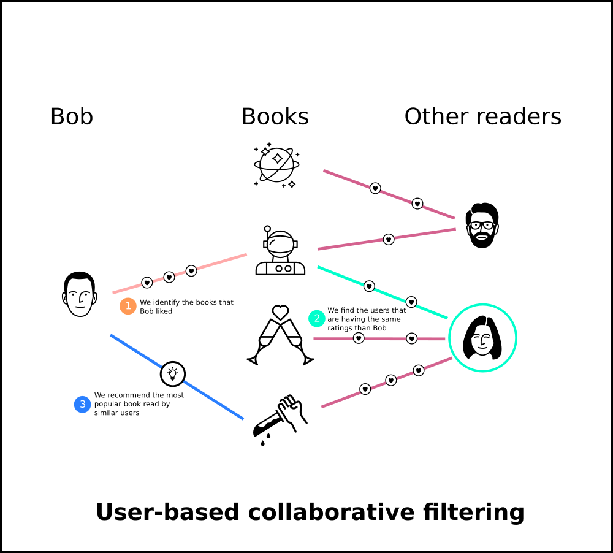

# Book Recommender System
In this project, I built a book recommender system from scratch using collaborative filtering.

You can see the top 50 popular books and it also recommends similar books to the given book.

This works based on previous data (user ratings, book details) where similarity is calculated based on the user behavior. 

This approach focuses on finding users who have given similar ratings to the same books, thus creating a link between users, to whom will be suggested books that were reviewed positively. In this way, we look for associations between users, not between books. 

In the above figure we recommend popular book to the bob where similar user read the book read by bob and other books with similar ratings. So, that bob can find interesting book which he had never seen yet.

### Demo:

### Try Out: https://brs-cf.herokuapp.com/ 
