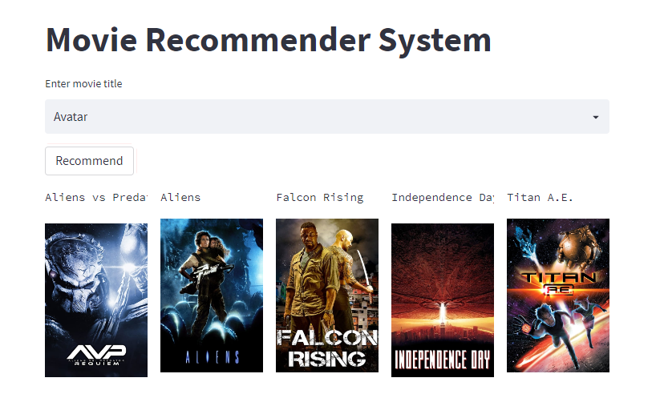
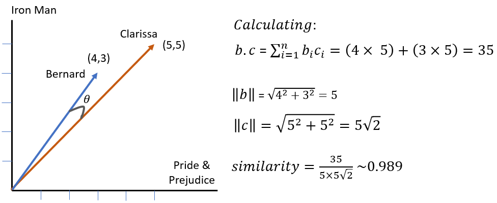
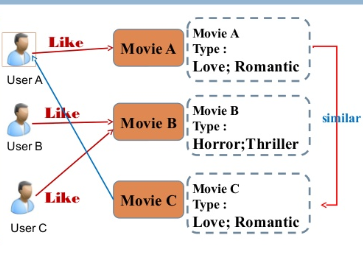

# Movie Recommender System
We build end-to-end movie recommender system with tmbd 5000 movie dataset which recommend movies based on cosine similarity as content based recommender system.

## Content Based Recommender System with Cosine Similarity

### Cosine Similarity
Cosine similarity is a metric used to measure how similar two items are. Mathematically, it measures the cosine of the angle between two vectors projected in a multi-dimensional space. The output value ranges from 0–1. 0 means no similarity, where as 1 means that both the items are 100% similar.
The cosine similarity will measure the similarity between these two vectors which is a measurement of how similar are the preferences between these two people.

Calculate cosine distance for each movie to all movies. Idea is if the cosine angle is very low then, it is similar and if the cosine angle is low then, it is dissimilar to each other.

In the example above the similarity 0.989 is close to the maximum value of 1, this means that given only two movie reviews the two users have similar preferences.

Theoretically, the cosine similarity can be any number between -1 and +1 because of the image of the cosine function, but in this case, there will not be any negative movie rating so the angle θ will be between 0º and 90º bounding the cosine similarity between 0 and 1. If the angle θ = 0º =>cosine similarity = 1, if θ = 90º => cosine similarity =0.

Cosine Similarity is calculated for n movie to each other n movie. We then calculate the distance of the given movie to the other n movie and return top x movie which are closest to that except itself.

**Note: For EDA and Model Building, go through the notebook**

### Content Based Recommender System

In this recommender system the content of the movie (overview, cast, crew, keyword, tagline etc) is used to find its similarity with other movies. Then the movies that are most likely to be similar are recommended.

The recommendation systems use this similarity matrix to recommend the next most similar product to the user. 
### Data: [TMDB 5000 Movie Dataset](https://www.kaggle.com/datasets/tmdb/tmdb-movie-metadata)

### Demo

### How to run?
1. First download data and place two csv file inside data directory.
2. Install packages on requirements.txt as: `pip install requirements.txt`
3. Download similarity matrix (Trained) from Drive: https://drive.google.com/file/d/1vDdHLd3rYBVNw6Xifk7-BnB5TGOrxxPI/view?usp=sharing
4. Run on cmd: `streamlit run app.py`
5. (Optional) To deploy on heroku, create new app and follow instruction. All the required setup files are included herewith.

#### Full Deployed App: [Heroku](https://mrs-imbd.herokuapp.com/)

